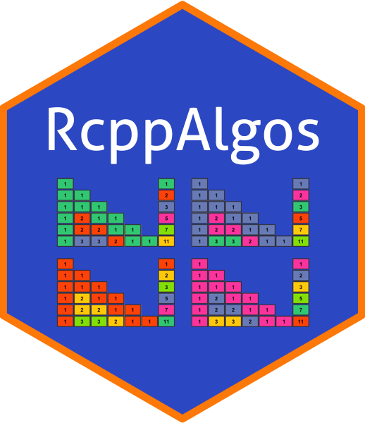

# RcppAlgos 

<!-- badges: start -->
[](https://cran.r-project.org/package=RcppAlgos)
[](https://travis-ci.com/jwood000/RcppAlgos)


[](https://codecov.io/github/jwood000/RcppAlgos?branch=master)
[](https://app.codacy.com/app/jwood000/RcppAlgos?utm_source=github.com&utm_medium=referral&utm_content=jwood000/RcppAlgos&utm_campaign=Badge_Grade_Settings)
[](https://cran.r-project.org/package=RcppAlgos)
<!-- badges: end -->

A collection of high performance functions implemented in C++ with Rcpp for solving problems in combinatorics and computational mathematics. Utilizes the [RcppThread](<https://github.com/tnagler/RcppThread>) library for easy access to thread safe multithreading. We also make use of the [RMatrix.h](<https://github.com/RcppCore/RcppParallel/blob/master/inst/include/RcppParallel/RMatrix.h>) header file from [RcppParallel](<https://github.com/RcppCore/RcppParallel>) for thread safe accessors for Rcpp matrices.

## Featured Functions

  - **`comboGeneral/permuteGeneral`**: Generate all combinations/permutations of a vector (including [multisets](<https://en.wikipedia.org/wiki/Multiset>)) meeting specific criteria.
  - **`comboSample/permuteSample`**: Generate reproducible random samples of combinations/permutations
  - **`comboIter/permuteIter`**: Flexible iterators allow for bidirectional iteration as well as random access.
  - **`primeSieve`**: Fast prime number generator
  - **`primeCount`**: Prime counting function using [Legendre's formula](<http://mathworld.wolfram.com/LegendresFormula.html>)

The `primeSieve` function and the `primeCount` function are both based off of the excellent work by [Kim Walisch](<https://github.com/kimwalisch>). The respective repos can be found here: [kimwalisch/primesieve](<https://github.com/kimwalisch/primesieve>); [kimwalisch/primecount](<https://github.com/kimwalisch/primecount>)

Additionally, many of the sieving functions make use of the fast integer division library [libdivide](<https://github.com/ridiculousfish/libdivide>) by [ridiculousfish](<https://github.com/ridiculousfish>).

## Benchmarks

* [High Performance Benchmarks](<https://jwood000.github.io/RcppAlgos/articles/HighPerformanceBenchmarks.html>)

## Installation

``` r
install.packages("RcppAlgos")

## install the development version
devtools::install_github("jwood000/RcppAlgos")
```

## Basic Usage

``` r
## Generate prime numbers
primeSieve(50, 100)
[1] 53 59 61 67 71 73 79 83 89 97


## Count prime numbers less than n
primeCount(1e10)
[1] 455052511


## Find all 3-tuples combinations of 1:4 
comboGeneral(4, 3)
     [,1] [,2] [,3]
[1,]   1    2    3
[2,]   1    2    4
[3,]   1    3    4
[4,]   2    3    4


## Alternatively, iterate over combinations
a = comboIter(4, 3)
a$nextIter()
[1] 1 2 3

a$back()
[1] 2 3 4

a[[2]]
[1] 1 2 4


## Pass any atomic type vector
permuteGeneral(letters, 3, upper = 4)
     [,1] [,2] [,3]
[1,] "a"  "b"  "c" 
[2,] "a"  "b"  "d" 
[3,] "a"  "b"  "e" 
[4,] "a"  "b"  "f" 


## Generate a reproducible sample
comboSample(10, 8, TRUE, n = 5, seed = 84)
     [,1] [,2] [,3] [,4] [,5] [,6] [,7] [,8]
[1,]    3    3    3    6    6   10   10   10
[2,]    1    3    3    4    4    7    9   10
[3,]    3    7    7    7    9   10   10   10
[4,]    3    3    3    9   10   10   10   10
[5,]    1    2    2    3    3    4    4    7


## Get combinations such that the product is between
## 3600 and 4000 (including 3600 but not 4000)
comboGeneral(5, 7, TRUE, constraintFun = "prod",
             comparisonFun = c(">=","<"),
             limitConstraints = c(3600, 4000),
             keepResults = TRUE)
     [,1] [,2] [,3] [,4] [,5] [,6] [,7] [,8]
[1,]    1    2    3    5    5    5    5 3750
[2,]    1    3    3    4    4    5    5 3600
[3,]    1    3    4    4    4    4    5 3840
[4,]    2    2    3    3    4    5    5 3600
[5,]    2    2    3    4    4    4    5 3840
[6,]    3    3    3    3    3    3    5 3645
[7,]    3    3    3    3    3    4    4 3888
```

## Further Reading

* [Function Documentation](<https://jwood000.github.io/RcppAlgos/reference/index.html>)
* [Computational Mathematics Overview](<https://jwood000.github.io/RcppAlgos/articles/ComputationalMathematics.html>)
* [Combination and Permutation Basics](<https://jwood000.github.io/RcppAlgos/articles/GeneralCombinatorics.html>)
* [Combinatorial Sampling](<https://jwood000.github.io/RcppAlgos/articles/CombinatorialSampling.html>)
* [Constraints, Integer Partitions, and Compositions](<https://jwood000.github.io/RcppAlgos/articles/CombPermConstraints.html>)
* [Attacking Problems Related to the Subset Sum Problem](<https://jwood000.github.io/RcppAlgos/articles/SubsetSum.html>)
* [Combinatorial Iterators in RcppAlgos](<https://jwood000.github.io/RcppAlgos/articles/CombinatoricsIterators.html>)

## Contact

I welcome any and all feedback. If you would like to report a bug, have a question, or have suggestions for possible improvements, please file an [issue](<https://github.com/jwood000/RcppAlgos/issues>).
