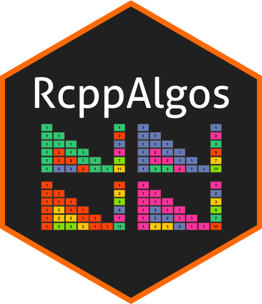

# RcppAlgos 

<!-- badges: start -->
[](<https://cran.r-project.org/package=RcppAlgos>)


[](<https://app.codacy.com/gh/jwood000/RcppAlgos/dashboard?utm_source=gh&utm_medium=referral&utm_content=&utm_campaign=Badge_grade>)
[](<https://cran.r-project.org/package=RcppAlgos>)
[](<https://github.com/jwood000/RcppAlgos/actions/workflows/R-CMD-check.yml>)
[](<https://app.codecov.io/gh/jwood000/RcppAlgos?branch=main>)
<!-- badges: end -->

`RcppAlgos` provides high-performance algorithms for working with combinatorial objects in R. It includes efficient implementations for combinations, permutations, integer partitions, and compositions, with support for multisets, constraints, and extremely large search spaces through memory-efficient iterators.

The package also implements specialized algorithms for problems rarely supported by other combinatorics libraries, including partitions of multisets, partitions of groups, and order-invariant Cartesian products. Many routines support ranking and unranking, parallel computation, and reproducible sampling. The package also includes fast prime number utilities built on the excellent work of [Kim Walisch](https://github.com/kimwalisch).

## Key Features

- High-performance generation of combinations and permutations
- Integer partitions and compositions under flexible constraints
- Support for multisets and restricted combinatorial structures
- Memory-efficient iterators for exploring very large combinatorial spaces
- Ranking and unranking algorithms
- Parallel computation support
- Fast prime number utilities:
  - `primeSieve` for generating primes
  - `primeCount` for counting primes using Legendre’s formula
  - `primeFactorize` for prime factorization
  
RcppAlgos is designed to handle combinatorial problems ranging from small enumerations to extremely large search spaces where generating all results at once would be impractical.

## What Makes `RcppAlgos` Unique

RcppAlgos implements several combinatorial algorithms that are uncommon or unavailable in most R libraries, including:

- partitions of multisets
- partitions of groups (`comboGroups`)
- order-invariant Cartesian products (`comboGrid`)
- compositions with distinct parts

## Performance

Detailed benchmarks can be found here:

[High Performance Benchmarks](<https://jwood000.github.io/RcppAlgos/articles/HighPerformanceBenchmarks.html>)

## Installation

``` r
install.packages("RcppAlgos")

## install the development version
devtools::install_github("jwood000/RcppAlgos")
```

## Usage

### Combinatorics Basics

``` r
## Find all 3-tuples combinations of 1:4
comboGeneral(4, 3)
#>      [,1] [,2] [,3]
#> [1,]   1    2    3
#> [2,]   1    2    4
#> [3,]   1    3    4
#> [4,]   2    3    4


## Alternatively, iterate over combinations
a <- comboIter(4, 3)
a@nextIter()
#> [1] 1 2 3

a@back()
#> [1] 2 3 4

a[[2]]
#> [1] 1 2 4


## Pass any atomic type vector
permuteGeneral(letters, 3, upper = 4)
#>      [,1] [,2] [,3]
#> [1,] "a"  "b"  "c"
#> [2,] "a"  "b"  "d"
#> [3,] "a"  "b"  "e"
#> [4,] "a"  "b"  "f"


## Generate a reproducible sample
comboSample(10, 8, TRUE, n = 5, seed = 84)
#>      [,1] [,2] [,3] [,4] [,5] [,6] [,7] [,8]
#> [1,]    3    3    3    6    6   10   10   10
#> [2,]    1    3    3    4    4    7    9   10
#> [3,]    3    7    7    7    9   10   10   10
#> [4,]    3    3    3    9   10   10   10   10
#> [5,]    1    2    2    3    3    4    4    7
```

### Integer Partitions and Compositions

``` r
## Flexible partitioning algorithms
partitionsGeneral(0:5, 3, freqs = rep(1:2, 3), target = 6)
#>      [,1] [,2] [,3]
#> [1,]    0    1    5
#> [2,]    0    2    4
#> [3,]    0    3    3
#> [4,]    1    1    4
#> [5,]    1    2    3


## And compositions
compositionsGeneral(0:3, repetition = TRUE)
#>      [,1] [,2] [,3]
#> [1,]    0    0    3
#> [2,]    0    1    2
#> [3,]    0    2    1
#> [4,]    1    1    1


## Get combinations such that the product is between
## 3600 and 4000 (including 3600 but not 4000)
comboGeneral(5, 7, TRUE, constraintFun = "prod",
             comparisonFun = c(">=","<"),
             limitConstraints = c(3600, 4000),
             keepResults = TRUE)
#>      [,1] [,2] [,3] [,4] [,5] [,6] [,7] [,8]
#> [1,]    1    2    3    5    5    5    5 3750
#> [2,]    1    3    3    4    4    5    5 3600
#> [3,]    1    3    4    4    4    4    5 3840
#> [4,]    2    2    3    3    4    5    5 3600
#> [5,]    2    2    3    4    4    4    5 3840
#> [6,]    3    3    3    3    3    3    5 3645
#> [7,]    3    3    3    3    3    4    4 3888


## We can also iterate over constrained cases. This is useful when we do not
## know the total number of results upfront, while still avoiding the cost of
## generating the full result set in memory.
p <- permuteIter(
  5, 7, TRUE,
  constraintFun = "prod",
  comparisonFun = c(">=", "<"),
  limitConstraints = c(3600, 4000)
)

p@nextIter()
#> [1] 1 2 3 5 5 5 5
```

### Cartesian Products

``` r
## Base R expand.grid returns a data.frame by default
## and varies the first column the fastest
bR <- expand.grid(rep(list(1:3), 3))
head(bR, n = 3)
#>   Var1 Var2 Var3
#> 1    1    1    1
#> 2    2    1    1
#> 3    3    1    1


## RcppAlgos::expandGrid returns a matrix if the input is of the same class,
## otherwise it returns a data.frame. Also varies the first column the slowest.
algos <- expandGrid(rep(list(1:3), 3))
head(algos, n = 3)
#>      Var1 Var2 Var3
#> [1,]    1    1    1
#> [2,]    1    1    2
#> [3,]    1    1    3


## With RcppAlgos::comboGrid order doesn't matter, so c(1, 1, 2),
## c(1, 2, 1), and c(2, 1, 1) are the same.
comboGrid(rep(list(1:3), 3))
#>       Var1 Var2 Var3
#>  [1,]    1    1    1
#>  [2,]    1    1    2
#>  [3,]    1    1    3
#>  [4,]    1    2    2
#>  [5,]    1    2    3
#>  [6,]    1    3    3
#>  [7,]    2    2    2
#>  [8,]    2    2    3
#>  [9,]    2    3    3
#> [10,]    3    3    3
```

### Partitions of Groups

Efficiently partition a vector into groups with `comboGroups`. For example, the code below finds all possible partitions into groups of size 2 and 3. See this Stack Overflow post:

[Find all possible team pairing schemes](<https://stackoverflow.com/a/76068476/4408538>)

``` r
players <- c("Ross", "Bobby", "Max", "Casper", "Jake")
comboGroups(players, grpSizes = c(2, 3))
#>       Grp1     Grp1     Grp2    Grp2     Grp2    
#>  [1,] "Ross"   "Bobby"  "Max"   "Casper" "Jake"  
#>  [2,] "Ross"   "Max"    "Bobby" "Casper" "Jake"  
#>  [3,] "Ross"   "Casper" "Bobby" "Max"    "Jake"  
#>  [4,] "Ross"   "Jake"   "Bobby" "Max"    "Casper"
#>  [5,] "Bobby"  "Max"    "Ross"  "Casper" "Jake"  
#>  [6,] "Bobby"  "Casper" "Ross"  "Max"    "Jake"  
#>  [7,] "Bobby"  "Jake"   "Ross"  "Max"    "Casper"
#>  [8,] "Max"    "Casper" "Ross"  "Bobby"  "Jake"  
#>  [9,] "Max"    "Jake"   "Ross"  "Bobby"  "Casper"
#> [10,] "Casper" "Jake"   "Ross"  "Bobby"  "Max"
```

### Computational Mathematics

``` r
## Generate prime numbers
primeSieve(50)
#> [1]  2  3  5  7 11 13 17 19 23 29 31 37 41 43 47

## Many of the functions can produce results in
## parallel for even greater performance
p <- primeSieve(1e15, 1e15 + 1e8, nThreads = 4)

head(p)
#> [1] 1000000000000037 1000000000000091 1000000000000159
#> [4] 1000000000000187 1000000000000223 1000000000000241
tail(p)
#> [1] 1000000099999847 1000000099999867 1000000099999907
#> [4] 1000000099999919 1000000099999931 1000000099999963


## Count prime numbers less than n
primeCount(1e10)
#> [1] 455052511

## Get the prime factorization
set.seed(24028)
primeFactorize(sample(1e15, 3), namedList = TRUE)
#> $`701030825091514`
#> [1]             2           149 2352452433193
#> 
#> $`83054168594779`
#> [1]  3098071 26808349
#> 
#> $`397803024735610`
#> [1]            2            5           13           13 235386405169
```

## Further Reading

* [Function Documentation](<https://jwood000.github.io/RcppAlgos/reference/index.html>)
* [Computational Mathematics Overview](<https://jwood000.github.io/RcppAlgos/articles/ComputationalMathematics.html>)
* [Combination and Permutation Basics](<https://jwood000.github.io/RcppAlgos/articles/GeneralCombinatorics.html>)
* [Integer Partitions in RcppAlgos](<https://jwood000.github.io/RcppAlgos/articles/IntegerPartitions.html>)
* [Integer Compositions in RcppAlgos](<https://jwood000.github.io/RcppAlgos/articles/IntegerCompositions.html>)
* [Combinatorial Sampling](<https://jwood000.github.io/RcppAlgos/articles/CombinatorialSampling.html>)
* [Constraints in RcppAlgos: Constraint-Driven Combinatorial Enumeration](<https://jwood000.github.io/RcppAlgos/articles/CombPermConstraints.html>)
* [Attacking Problems Related to the Subset Sum Problem](<https://jwood000.github.io/RcppAlgos/articles/SubsetSum.html>)
* [Combinatorial Iterators in RcppAlgos](<https://jwood000.github.io/RcppAlgos/articles/CombinatoricsIterators.html>)
* [Cartesian Products and Partitions of Groups](<https://jwood000.github.io/RcppAlgos/articles/OtherCombinatorics.html>)

## Why **`RcppAlgos`** but no **`Rcpp`**?

Earlier versions of `RcppAlgos` relied on [Rcpp](<https://github.com/RcppCore/Rcpp>) to interface C++ with R. The current implementation uses [cpp11](<https://github.com/r-lib/cpp11>), which provides a lightweight interface to R’s C API. While the package no longer depends on `Rcpp`, the project owes much to the excellent work of the `Rcpp` community.

## Contact

If you would like to report a bug, have a question, or have suggestions for possible improvements, please file an [issue](<https://github.com/jwood000/RcppAlgos/issues>).
